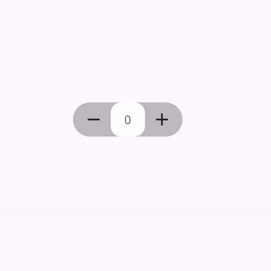

[](https://www.android.com)
 [](https://jitpack.io/#Saif-al-islam/SlideCounter-Android)
 []()

**SliderCounterView** - An Android library that can increase and decrease the Count.

## Sample


## Usage

### step 1

Include the library as a local library project or add the dependency in your build.gradle.

```groovy
dependencies {
	   implementation 'com.github.Saif-al-islam:SlideCounter-Android:0.1.0'
	}
```

Add it in your root build.gradle.

```groovy
allprojects {
		repositories {
			maven { url 'https://jitpack.io' }
		}
	}
```

### Step 2

Include the SliderCounterView in your layout. And you can customize it like this.

```xml
    <com.saif.slidecounter.SlideCounter
            android:id="@+id/num_pick"
            android:layout_width="wrap_content"
            android:layout_height="wrap_content"
            android:background="@color/gray_1"
            app:init_counter="1"
            app:min_counter="0"
            app:max_counter="100"
            app:step_counter="1"
            app:start_color_counter="#FFFFFF"
            app:end_color_counter="#000000"
            app:radius_counter="12dp"
            />
```

## XML Attributes Description

|name|format|description|
|:---:|:---:|:---:|
| min_counter | integer | Minimum value of the counter, default is 0
| max_counter | integer | Maximum value of the counter and -1 for infinite counter (no maximum number), default is -1
| init_counter | integer | Start value of the counter，default is 0
| step_counter | integer | Increasing value for one step value of the counter，default is 1
| counter_in_milli_seconds | Integer | Speed of the increased or decreased of the counter / the time in milliSeconds between every increased or decreased value , default is 400ms
| start_color_counter | color | Start Color when user start dragging , default is WHITE
| end_color_counter | color | End Color when the counter reach the end of the view , default is WHITE
| radius_counter | dimension | the radius of the view's corner.


## Code Attribute Description

All the attribute of the xml can be changed throw the Java/Kotlin code in addition to:

|name|parameters|description|
|:---:|:---:|:---:|
| setSlideCounterListener | OnSlideCounterListener | This Function is called every time the Current value of the counter change


